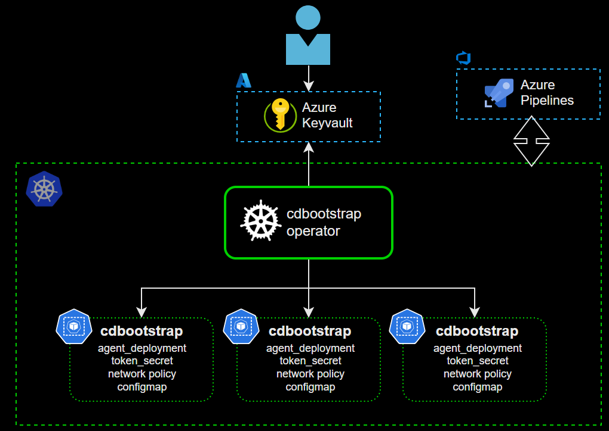

# cdbootstrap operator

Seamless integration and automation between datacenter sites are paramount. To streamline this process, we introduce the Kubernetes CDBootstrap Operator, designed specifically for initializing pipeline agents and establishing a robust connection with an external customer DevOps environment, eliminating the need for ingress requirements. The operator facilitates secure communication between the pipeline agent on Kubernetes and the external DevOps environment, employing industry best practices for encryption, authentication, and authorization.

